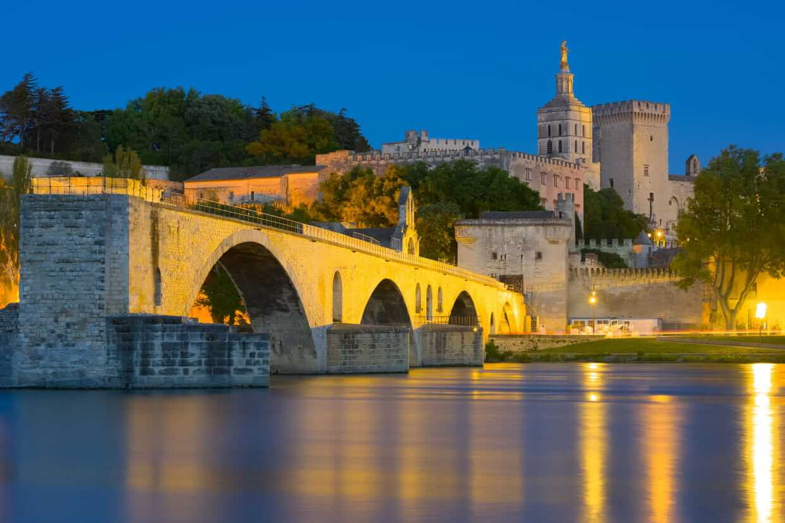
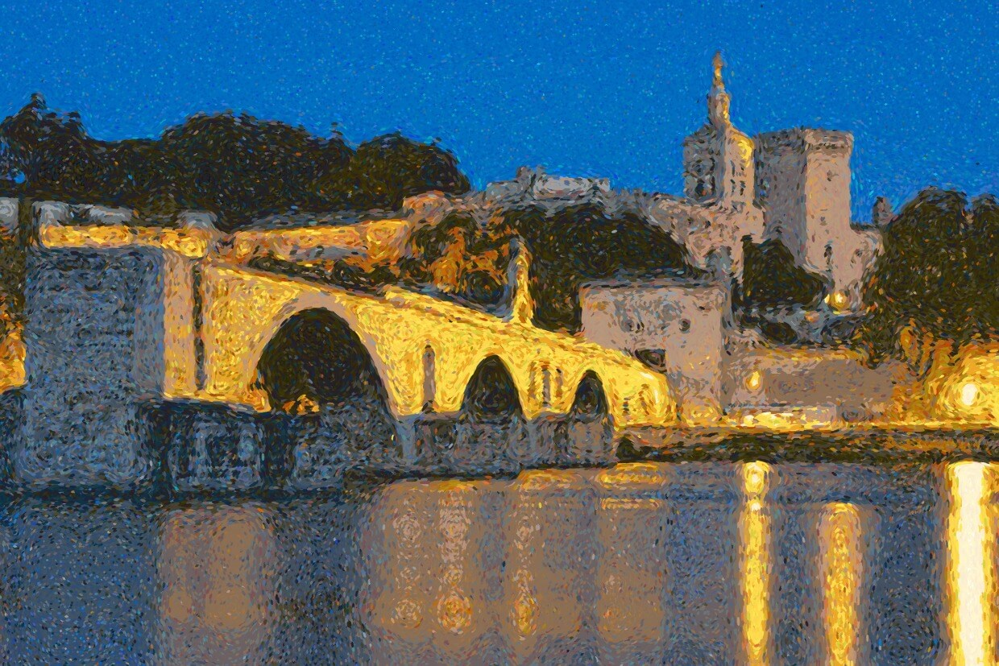

# To Pointillism

Convert any images to pointillism painting.

[Try by yourself 🙂 ](https://guillaume-gomez.github.io/to-pointillism/) 

## Examples

### Original (Avignon bridge)

### Converted (Avignon bridge)

### Original (Caravaggio)

### Converted (Caravaggio)

### Converted (as gif)

[caravaggio-gif.webm](https://github.com/user-attachments/assets/31b8941c-ec08-48b6-88b1-ec520a3ab749)

### Original (mondrian generation from my repo mondrian verse)

### converted 

## references

background made by [Dung Tran](https://pixabay.com/users/kollsd-14736411/?utm_source=link-attribution&utm_medium=referral&utm_campaign=image&utm_content=4922621) (modified by the algorithm)

Arrow svg from [freepik](https://www.flaticon.com/authors/freepik)

Strongly inspired from this [article](https://medium.com/hackernoon/https-medium-com-matteoronchetti-pointillism-with-python-and-opencv-f4274e6bbb7b)
